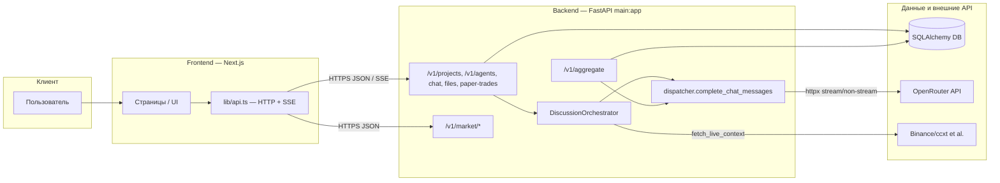
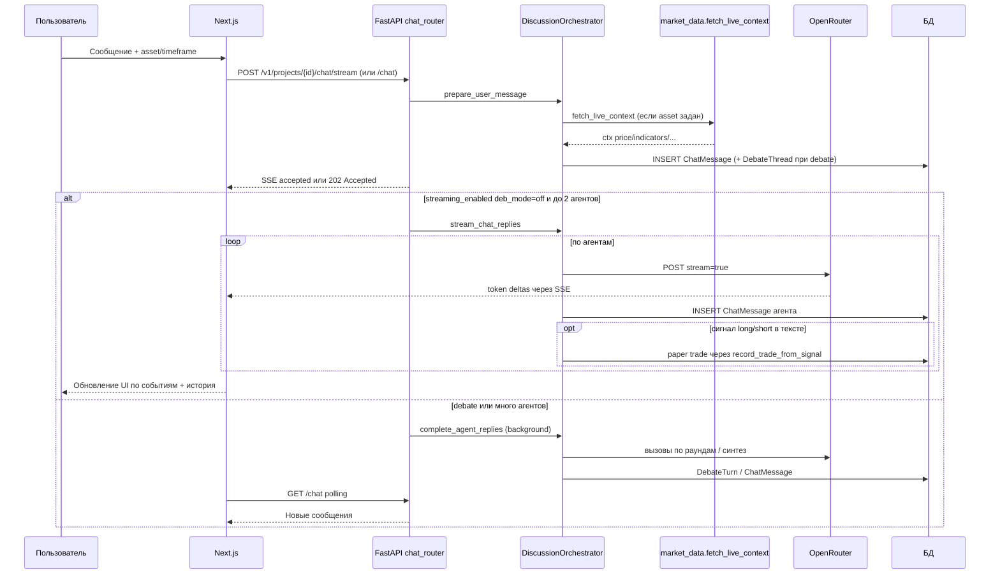
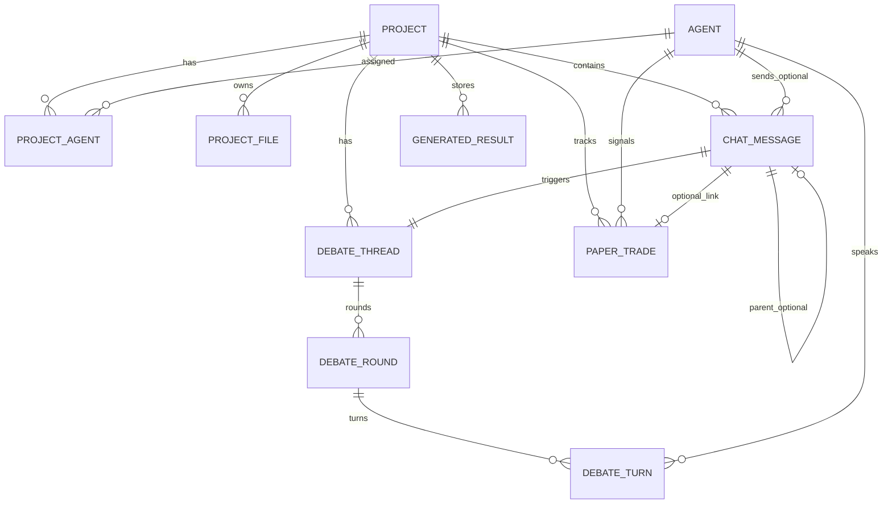

# SYSTEM_ARCHITECTURE.md

Исчерпывающее техническое описание архитектуры репозитория **на основе текущего кода**. Целевая аудитория: новый разработчик, DevOps, технический инвестор.

---

## 1. Обзор архитектуры (high-level)

### 1.1 Назначение системы

Платформа **«AI Team Platform»**: пользователь создаёт **проекты**, подключает к проекту **агентов** из общей библиотеки, ведёт **групповой чат** с оркестрацией ответов (одиночный ответ, последовательная цепочка, многораундовый **debate** с синтезом). Для крипто-сценариев поддерживается **LIVE DATA CONTEXT** (рынок через `market_data`) и **paper trading** (запись виртуальных сделок по сигналам и сводки метрик на фронтенде).

Бэкенд в `main.py` по-прежнему называется **«LLM Aggregator»** и дополнительно экспонирует отдельный REST-поток **`POST /v1/aggregate`** (мульти-маршрутная агрегация по `routes.yaml`, кэш, бюджет) — это **другой** контур, чем чат проектов.

### 1.2 Стек технологий

| Слой | Технологии |
|------|------------|
| **Frontend** | Next.js (App Router), React, TypeScript, Tailwind/shadcn-подобные UI-компоненты, клиентский `fetch` + SSE для стрима чата |
| **Backend** | Python 3.12, FastAPI, Uvicorn, SQLAlchemy 2.0 async, Pydantic / pydantic-settings, httpx (единый `AsyncClient` в `app.state`), Tenacity (ретраи HTTP к LLM) |
| **БД** | По умолчанию SQLite (`sqlite+aiosqlite`); продакшен обычно переводится на **PostgreSQL** через `DATABASE_URL` |
| **LLM** | OpenRouter (OpenAI-совместимый `POST .../chat/completions`), ключ и базовый URL из env / `Settings` |
| **Market data** | ccxt (Binance async), pandas / pandas-ta (индикаторы), внутрипроцессный TTL-кэш |
| **Hosting / контейнеры** | `railway.json` (политика рестартов); Docker: `frontend/Dockerfile` (multi-stage, Next **standalone**), `backend/Dockerfile` (single-stage Python) |

### 1.3 Диаграмма компонентов (Mermaid)



---

## 2. Потоки данных (data flow)

### 2.1 Общий путь: от сообщения пользователя до ответа агента

1. Пользователь отправляет сообщение из UI (обычно через `sendProjectChat` или `streamChatMessage` в `frontend/lib/api.ts`).
2. FastAPI **`POST /v1/projects/{project_id}/chat`** (202 + тело «принято») или **`POST .../chat/stream`** (SSE).
3. `DiscussionOrchestrator.prepare_user_message`:
   - сохраняет сообщение пользователя (`ChatMessage`);
   - выбирает агентов (@упоминания, явный список id, режим `debate_mode`, скрытый Router при `auto` / `off`);
   - при переданных `asset` / `timeframe` подгружает рыночный контекст (`fetch_live_context`) и прокидывает метаданные свежести в ответ клиенту;
   - при режиме debate создаёт `DebateThread` и задаёт таймаут стены (масштабирование от `CHAT_DEBATE_*`).
4. Генерация ответов:
   - **Обычный чат**: фоновая задача `complete_agent_replies` (после ответа HTTP клиент опрашивает **`GET /v1/projects/{id}/chat`**).
   - **Стрим** (см. ниже): `stream_chat_replies` отдаёт события SSE до завершения.

### 2.2 Сценарий «Crypto Analysis» (последовательность)

Ниже — типичный путь, когда пользователь указал актив/таймфрейм и в команде есть крипто-роли (`technical_analyst`, `onchain_analyst`, и т.д.; см. `_CRYPTO_AGENT_ROLES` в оркестраторе).



### 2.3 Streaming (SSE)

- Эндпоинт: **`POST /v1/projects/{project_id}/chat/stream`**, `media_type: text/event-stream`; каждая порция — строка `data: {json}\n\n` (`chat_router._sse_event`).
- **Условие стриминга токенов** (код): `debate_mode == "off"` **и** `len(pending_agent_ids) <= 2`. Иначе клиент получает события `accepted`, затем `streaming_disabled` с причиной `debate_or_many_agents`, а завершение идёт через фоновый `complete_agent_replies` (как обычный POST `/chat`).
- Типы событий, которые парсит фронт (`StreamChatEvent` в `api.ts`): `accepted`, `streaming_disabled`, `round_start`, `token`, `agent_done`, `error`, `complete`.

### 2.4 Кэширование

| Область | Механизм | Где в коде |
|---------|-----------|------------|
| Рыночные OHLCV и производные | In-memory TTL-кэш (`_CACHE`, `_CACHE_LOCK`), при ошибке сети — fallback на **просроченную** запись | `app/services/market_data.py` (`fetch_ohlcv`, `fetch_live_context`) |
| Агрегация `/v1/aggregate` | `AggregationCache` в `app.state`, ключи TTL из настроек | `app/core/cache.py`, `app/api/router.py` |
| Чат / оркестратор | Отдельного Redis-кэша ответов чата в коде **нет** | — |

Поля **`data_freshness`** / **`source`** в ответе чата отражают состояние рыночного снимка (`live` / `cached` / `unavailable`), см. `ChatAcceptedResponse` в `app/models/platform_schemas.py`.

---

## 3. Ключевые модули (core components)

### 3.1 Backend core (FastAPI)

- **`main.py`**: создание `FastAPI`, подключение **`lifespan`**, CORS (`CORSMiddleware`), монтирование роутеров.
- **Роутеры**:
  - `app/api/router.py` — **`/v1/aggregate`** (+ заголовок-заглушка 429, см. раздел 7).
  - `app/api/projects_router.py` — CRUD проектов, агенты проекта, файлы метаданные, результаты, **paper trades**.
  - `app/api/chat_router.py` — история чата, отправка, стрим, статус/log/cancel debate.
  - `app/api/files_router.py`, `app/api/agent_library_router.py`, `app/api/market_router.py`, `app/api/metrics_router.py` (`GET /metrics` Prometheus text).
- **`app/core/lifespan.py`**: один **`httpx.AsyncClient`** на приложение, `Settings`, `RoutesConfig`, `BudgetLimiter`, `AggregationCache`, `FileStorage`, `init_db`, `seed_agents`.

### 3.2 AI Orchestrator (`DiscussionOrchestrator`)

Файл: `app/services/discussion_orchestrator.py`.

- **Router (режим `debate_mode=auto`)** — `route_and_plan`: вызов LLM (`gpt-4o-mini` через `complete_chat_messages`) с инструкцией вернуть строгий JSON: `flow` ∈ {`off`,`sequential`,`debate`}, `debate_rounds`, `selected_agent_ids`, `ordered_agent_ids`, `confidence`, `reason`. При сбое / низкой уверенности — **fallback** через `route_question` или состав команды по умолчанию.
- **Router при `debate_mode=off`** — `route_question`: JSON с `selected_agent_ids` (до 3 агентов), опциональный порядок; fallback на всю команду при ошибках / низком confidence.
- **Режимы исполнения**:
  - **`off`**: при `off_chain_style=="parallel"` ответы могут идти параллельно (`asyncio.gather`-подобная схема с `asyncio.as_completed` в `complete_agent_replies`); иначе последовательное сохранение с учётом порядка.
  - **`sequential`**: цепочка с видимостью предыдущих ответов в промпте (`build_agent_prompt`).
  - **`debate`** (`fast`/`standard`/`deep`): `_run_multi_round_debate` — раунды, сохранение `DebateRound` / `DebateTurn`, финальный синтез скрытым агентом (`_SYNTHESIZER_MODEL`), обновление `DebateThread`.
- **Runtime Guard (Risk Manager)**: если `CHAT_RISK_GUARD_ENABLED` и роль `risk_manager`, ответ валидируется regex-эвристикой; при провале — попытка `_auto_fix_risk_response`, иначе текст-заглушка `_RISK_MANAGER_FALLBACK_TEXT`. То же для потокового пути после сборки полного текста.
- **Модели по умолчанию** (константы модуля): агент без `Agent.model` → `meta-llama/llama-3.3-70b-instruct`; Router → `openai/gpt-4o-mini`; при стриме при ошибке модели — **fallback** на дефолтную Llama 3.3 70B.

### 3.3 Data pipeline (Market Data Service)

- Модуль **`app/services/market_data.py`**: OHLCV через ccxt Binance, индикаторы, деривативные метрики, fear&greed, новости/sentiment — собирается в **`fetch_live_context`**, форматируется в Markdown для промпта через **`format_live_context_markdown`**.
- **Fallback**: при ошибке загрузки свечей, если нет кэша — `data_freshness: unavailable`; если кэш есть — используются устаревшие данные (`freshness: cached`, `stale_data: True`).
- **HTTP API**: `GET /v1/market/context`, `GET /v1/market/health` (см. `market_router.py`).

### 3.4 Paper trading

- **Запись из оркестратора**: после сохранения ответа агента вызывается **`_maybe_record_paper_trade`** → **`record_trade_from_signal`** (`app/services/paper_trading.py`), если роль в множестве технических/риск-аналитиков и из текста извлечён сигнал **long** / **short** (эвристика по словам «бычий» / «медвеж»).
- Парсинг уровней: regex для уверенности %, SL/TP, времени сигнала; цена входа из `market_context` или повторный `fetch_live_context`.
- **Сверка открытых сделок**: `reconcile_open_trades` — обновление по текущей цене, статусы `closed` / `stopped`, расчёт **`pnl_pct`** (формулы long/short в коде).
- **REST**: список / создание / закрытие / reconcile — в `projects_router` под `/v1/projects/{id}/paper-trades...`.
- **Win Rate, Total PnL и др.** на UI считаются на клиенте (например `frontend/app/project/[id]/paper-trading/page.tsx`: `winRate = profitable/closed`, сумма `pnl_pct`).

---

## 4. Схема данных (database schema)

ORM: **`app/models/database.py`**. Идентификаторы — строковые UUID (36 символов).

### 4.1 Сущности и связи

| Сущность | Описание |
|----------|----------|
| **Agent** | Глобальный каталог агента: `name`, `model`, `role`, `system_prompt`, `color`, `is_active` |
| **AgentLibraryFile** | Файлы библиотеки агента (FK → `agents.id`, CASCADE) |
| **Project** | Проект: `name`, `description`, `is_crypto_enabled`, временные метки |
| **ProjectAgent** | Связь **многие-ко-многим** Project ↔ Agent с атрибутами `joined_at`, `is_active`; уникальность пара `(project_id, agent_id)` |
| **ProjectFile** | Файл проекта (метаданные + путь на диске `UPLOAD_DIR`) |
| **ChatMessage** | Сообщение чата; FK `project_id` → Project; опционально `sender_id` → Agent (**many-to-one**); самоссылка `parent_message_id` для тредов |
| **DebateThread** | Тред дискуссии для одного пользовательского сообщения (FK на `chat_messages`) |
| **DebateRound** | Раунд внутри треда (**one-to-many** от Thread) |
| **DebateTurn** | Реплика агента в раунде (**many-to-one** к Round и Agent) |
| **GeneratedResult** | Артефакт агента в проекте |
| **PaperTrade** | Виртуальная сделка: FK `project_id`, `agent_id`, опционально `message_id` |

### 4.2 ER-диаграмма (упрощённо)



---

## 5. API контракты

Базовый префикс платформенных маршрутов: **`/v1`** (кроме корня `/`, `/metrics`, агрегатора уже под `/v1`).

### 5.1 Группы эндпоинтов

| Группа | Примеры | Назначение |
|--------|---------|------------|
| **Chat** | `GET/POST /v1/projects/{id}/chat`, `POST .../chat/stream`, `GET .../debates/{tid}`, `GET .../debates/{tid}/log`, `POST .../debates/{tid}/cancel` | История, приём сообщения, SSE, наблюдение за debate |
| **Agents** | `GET /v1/agents`, операции библиотеки в `agent_library_router` | Каталог и управление шаблонами агентов |
| **Projects** | `GET/POST /v1/projects`, `GET/PUT/DELETE /v1/projects/{id}`, агенты проекта, файлы, `generated_results`, paper trades | Жизненный цикл проекта и артефактов |
| **Market** | `GET /v1/market/context`, `GET /v1/market/health` | Диагностика и снимок рынка для UI |
| **Paper trading** | `GET/POST /v1/projects/{id}/paper-trades`, `POST .../{trade_id}/close`, `POST .../reconcile` | Сделки и сверка |
| **Files** | Загрузка/скачивание по `files_router` | Хранилище вложений |
| **Aggregate** | `POST /v1/aggregate` | Мульти-модельная агрегация по `routes.yaml` (не смешивать с бизнес-логикой чата проектов) |

### 5.2 Тело запроса чата (пример контракта)

Из **`ChatSendRequest`** (`app/models/platform_schemas.py`):

```json
{
  "content": "Проанализируй BTC на 4H",
  "is_discussion": null,
  "mentioned_agent_ids": null,
  "temperature": 0.7,
  "debate_mode": "auto",
  "locale": "ru",
  "file_ids": [],
  "asset": "BTC/USDT",
  "timeframe": "4H"
}
```

Поля `asset` / `timeframe` опциональны и включают блок LIVE DATA в промпт для крипто-ролей.

### 5.3 Аутентификация

В платформенных роутерах **нет** проверки JWT/API-ключа на уровне FastAPI Dependencies: API в текущей версии **открытый** с точки зрения HTTP auth. Защита на периметре (VPN, Railway auth, reverse proxy) — зона деплоя.

Клиентский URL бэкенда задаётся цепочкой (**`getApiBaseUrl`** в `frontend/lib/api.ts`):

1. `data-api-public-url` на `<html>` (runtime из `BACKEND_PUBLIC_URL` в `app/layout.tsx`);
2. `BACKEND_PUBLIC_URL` / `NEXT_PUBLIC_API_URL` / `NEXT_PUBLIC_API_BASE_URL`;
3. fallback `http://127.0.0.1:8000`.

---

## 6. Инфраструктура и деплой

### 6.1 Railway

Файл **`railway.json`** задаёт только **политику рестарта** при падении (`ON_FAILURE`, до 10 попыток). Конкретная топология сервисов (отдельные сервисы Postgres / Backend / Frontend) в репозитории **не закреплена** — типичный вариант: три сервиса + переменные окружения для URL фронта к бэкенду и `DATABASE_URL` для PostgreSQL.

### 6.2 Docker

**Frontend** (`frontend/Dockerfile`):

- Stage **builder**: `npm install`, `npm run build`, проброс `ARG`/`ENV` для `NEXT_PUBLIC_*`.
- Stage **runner**: копирование **standalone**-дерева (`standalone/server.js`), **`standalone/.next/static`**, **`standalone/public`**; `HOSTNAME=0.0.0.0`; команда `node server.js`.

**Backend** (`backend/Dockerfile`):

- Одностадийный образ Python 3.12-slim: зависимости из **`requirements.txt`**, копирование исходников, запуск `uvicorn main:app --host 0.0.0.0 --port ${PORT:-8000}`.

> Контекст сборки Docker должен включать **`main.py` и `requirements.txt` в корне репозитория** (как сейчас устроен проект); при смене структуры нужно скорректировать `COPY` в Dockerfile.

### 6.3 Переменные окружения (критичные)

Загрузка через **`app/config/loader.py`** (`Settings`, pydantic-settings + `.env` в корне).

| Переменная | Назначение |
|------------|------------|
| `DATABASE_URL` | Строка подключения SQLAlchemy async (по умолчанию SQLite в файле `./ai_platform.db`) |
| `OPENROUTER_API_KEY` | Ключ OpenRouter (в логах не выводится) |
| `OPENROUTER_BASE_URL` | Базовый URL API (по умолчанию `https://openrouter.ai/api/v1`) |
| `OPENROUTER_HTTP_REFERER`, `OPENROUTER_APP_TITLE` | Обязательные для статистики OpenRouter заголовки |
| `AGGREGATE_MOCK` (`aggregate_mock_providers`) | При `true` отключает реальные вызовы провайдеров в агрегаторе и в чате используются mock/ограничения (локальная разработка без оплаты) |
| `CORS_ALLOWED_ORIGINS` | Дополнительные origins через запятую (продакшен-домен фронта) |
| `UPLOAD_DIR`, `MAX_FILE_SIZE_MB`, `ALLOWED_FILE_TYPES` | Файловое хранилище вложений |
| `MAX_COST_PER_REQUEST`, `MAX_DAILY_COST`, `ESTIMATED_COST_PER_ROUTE_USD` | Бюджетный лимитер для **`/v1/aggregate`** |
| `CACHE_TTL_SECONDS`, `CACHE_MAX_ENTRIES` | Кэш ответов агрегатора |
| `CHAT_*` | Лимиты истории, температура по умолчанию, таймауты ответа и debate, лимиты размеров вложений в чат, `CHAT_RISK_GUARD_ENABLED` |
| **`BACKEND_PUBLIC_URL`** (Next.js) | Публичный URL API для браузера без пересборки при наличии `data-api-public-url` |

---

## 7. Безопасность и надёжность

### 7.1 CORS

В **`main.py`**: разрешены локальные origin `localhost` / `127.0.0.1` на портах 3000 и 3001 плюс список из **`CORS_ALLOWED_ORIGINS`**; `allow_credentials=True`, методы и заголовки — широкие (`*`). Для прода необходимо явно перечислить фронтовый домен в env.

### 7.2 Ошибки и отказоустойчивость

- **Диспетчер LLM** (`app/services/dispatcher.py`): для HTTP-к ошибок класса **429 и 5xx** используется **Tenacity** (`AsyncRetrying`) с экспоненциальной задержкой.
- **Стрим чата**: при ошибке основной модели выполняется **fallback** на `_DEFAULT_OPENROUTER_MODEL` (Llama 3.3 70B).
- **Рыночные данные**: повторные попытки на уровне отдельных запросов (например `@retry` на `_fetch_ohlcv_remote`), при полном провале — деградация до unavailable/stale cache.
- **Риск-менеджер**: автокоррекция или безопасная заглушка вместо некорректного формата ответа.

### 7.3 Rate limiting и лимиты затрат

- Эндпоинт **`POST /v1/aggregate`**: при заголовке **`X-Skeleton-Force-429: 1`** возвращается HTTP 429 с `Retry-After` (тестовая заглушка, см. `app/api/router.py`).
- **`BudgetLimiter`** в `app.state` ограничивает оценочную стоимость запроса и дневной бюджет для потока агрегации (не как отдельный HTTP rate-limit middleware для всего API).
- Binance/ccxt: **`enableRateLimit: True`** на биржевом клиенте.

### 7.4 Логирование

Согласно правилам репозитория: не логировать полный текст запросов пользователя, ключи API и сырые payloads; в логах — **`request_id`**, маршруты, статусы, метрики (см. `log_payload` в оркестраторе и диспетчере).

---

## Связанные документы

- Краткий обзор по-русски: `docs/ARCHITECTURE.md` (если присутствует в репозитории).
- Контракты Pydantic: `app/models/platform_schemas.py`, `app/models/schemas.py` (aggregate).

---

*Документ сгенерирован по состоянию кодовой базы; при изменении модулей оркестратора, схемы БД или API имеет смысл обновить соответствующие разделы.*
